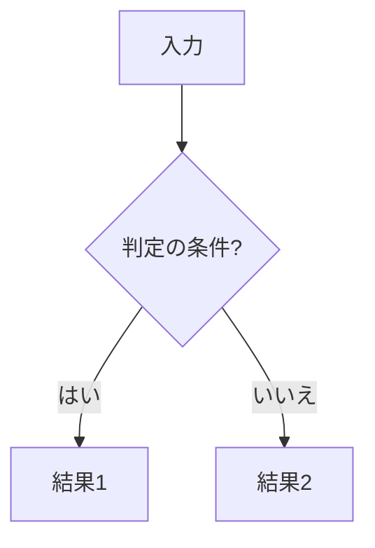
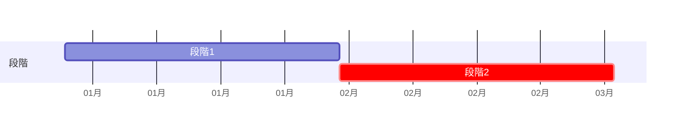

# [要確認] 文書の題名（主題の名詞。例: 請求書取り込みの運用・移行設計）

<!-- 原文: [要確認] 文書名（原文日付、行数、所在）。本書は組み替え案で、原文は変更していない。
     主張の出所は ../claims.csv。[要確認] はまだ決めていない値で、本書では補っていない。 -->

| 項目 | 内容 |
|---|---|
| この文書で決めること | [要確認] |
| 読む人 | [要確認] 担当者と、§1 だけ読めばよい人 |
| 関連文書 | [要確認] 正本の所在（規則／本番構成／指標・合格条件） |
| 原文 | [要確認] 文書名（原文日付、行数）。原文の章との対応は付録C |
| 状態 | 組み替え案（YYYY-MM-DD）。決定・方針・想定・提案・未決の区別は各表の「状態」列と claims.csv |

## 1. 要点と判断事項

| 項目 | 内容 | 状態 |
|---|---|---|
| 解く問題 | [要確認] | |
| 対象 | [要確認] 対象と対象外 | |
| 提案の要点 | [要確認] | |
| 今回決めたこと | [要確認] §1.2 | |
| まだ決めていない点 | [要確認] §1.3 | |

### 1.1 目的と対象

### 1.2 今回決めたこと

1. [要確認] 決めたこと1（C1）

### 1.3 まだ決めていない点

| 項目 | 決める担当 | 決め方 |
|---|---|---|
| [要確認] | [要確認] | [要確認] |

## 2. 現行と変更後の全体像

| | 現行 | 変更後 |
|---|---|---|
| [要確認] 観点1 | | |

## 3. 日常の流れ

| 周期 | 機械（自動） | 人 | 担当 |
|---|---|---|---|
| 日次 | | | |
| 週次 | | | |
| 月次 | | | |
| 異常時 | | | |

## 4. 判断基準と例外・変更への対応

### 4.1 判定の規則

### 4.2 警報と合格条件

| 用途 | 指標 | データ | 頻度 | 対応 | 状態 |
|---|---|---|---|---|---|

### 4.3 異常の対応

### 4.4 変更と復旧の単位

## 5. 計画

| 段階 | 期間（想定） | 次へ進む条件 | 戻す条件 | 判定者 |
|---|---|---|---|---|

## 6. 体制と作業量

| 担当 | 役割 | 定期の工数（想定） |
|---|---|---|

## 付録A 原文の要件表との対応

| 要件 | 内容 | 原文の参照先 | 本書 |
|---|---|---|---|

## 付録B 用語

| 用語 | 本書での意味 | 状態 |
|---|---|---|

## 付録C 原文の章との対応

| 原文の章 | 本書 |
|---|---|
