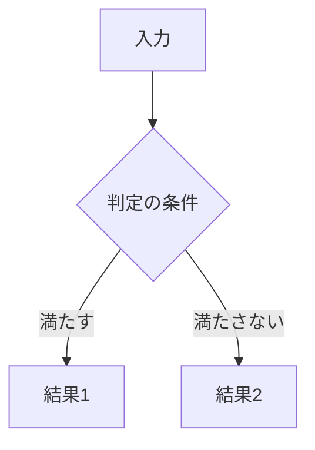
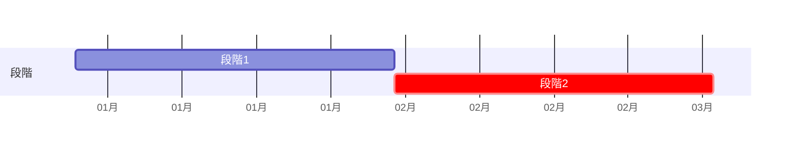

# [要確認] 文書の題名（主題の名詞。例: 請求書取り込みの運用・移行設計）

<!-- 原文: [要確認] 文書名（原文日付、行数、所在）。本書は改稿案で、原文は変更していない。
     主張の出所は ../claims.csv。主張IDは本文に見せず、正本の段落か表の直後に claims のコメント（claims: C1,C2 の形）で書く。
     短い原文（読む字数1500字未満）では、冒頭の表と付録の章の対応をこのようなコメントに移し、§1 は箇条書き1つ（7行まで）にする。
     報告に回した穴の件数も、本文ではなくコメントに書く（報告に回した穴: N件）。
     作業の経緯（何をまとめた・削った・仮に決めた）は本文に書かず、本人への報告に書く。
     冒頭（この表と §1）は合わせて1000字まで。「位置づけ」「読み方」「文書一覧」「記法の説明」の章は作らない（要るものはこの表の1行か付録）。
     引く表（要件の一覧・未決の全一覧・用語）は付録に置き、本文の途中に置かない。章の型（文・表・図の並び）は章の問いで変え、同じ型を3章以上続けない。 -->

| 項目 | 内容 |
|---|---|
| この文書が扱うこと | [要確認] |
| 読む人 | [要確認] 読む人ごとに読む章を添える（「経理課（§3〜§4）・情報システム課（§4〜§5）の担当者。可否を判断する人は §1 だけ」） |
| 関連文書 | [要確認] 正本の所在（規則／本番構成／指標・合格条件）。無ければ行ごと消す |
| 原文 | [要確認] 文書名（原文日付、行数）。章の対応は付録 |
| 状態 | 改稿案（YYYY-MM-DD）。特記の無い記述は原文の方針。決定・想定・参考値・未決・提案はその場に書く |

## 1. 要点と判断事項

<!-- 4行は必ず置く。要点は値と正本への参照だけで、理由と詳細は正本の章に1回だけ書く。§1（1.1 を含む）は読む字数の3割まで -->

| 項目 | 要点 | 正本 |
|---|---|---|
| 何を変えるか | [要確認] 1行（現行 → 変更後、対象） | §2 |
| 次へ進む条件 | [要確認] 合格条件の値と試行の期間（「見逃し0件かつ誤通知率30%以下」。「2条件」と書かない）。原文に無ければ「原文に無い」 | §[要確認] |
| まだ決めていない点 | [要確認] N点（レビューで足したものがあれば「うちレビューで足した M点」） | §1.1 |
| 決めたこと | [要確認] 決めた人と日付が残る決定（無ければ「原文に決定は無い。本書の記述は原文の方針（ドラフト）」） | §[要確認] |

### 1.1 まだ決めていない点

<!-- 載せるのは原文の未決・原文の矛盾（2つの記述が同時に成り立たないものだけ。両方の値を1句で書く）・中身の無い段落を未決にしたもの・運用に要る欠け（担当・頻度・値の無い原文の作業）・本人が採った追加（項目に「（レビューで追加）」）だけ。
     作業中に気づいた穴は claims.csv に target none で入れて報告に書き、本文には書かない（件数はコメントに）。
     「進むのを止める」は原文か本人がそう書いたときだけ。[要確認] はここで1回だけ。本文では「未決（§1.1）」と参照する。
     決める担当が原文にある行が半分未満なら担当の列を作らず、分かる担当だけ項目に添える。決め方が分からなければ列ごと消す。
     行は7つまで。超える分は付録C「未決の一覧」へ移し、§1 の「まだ決めていない点」に件数と「残りは付録C」を書く（末尾の章から本文へ「（§14）」と飛ばさない） -->

| 項目 | 決める担当 | 決め方 |
|---|---|---|
| [要確認] 何が決まっていないか（矛盾なら両方の値） | [要確認] | [要確認] |

<!-- claims: C[要確認] -->

## 2. 現行と変更後の全体像

<!-- 原文が置き換えを書いていて、両側に原文の値がある行が2行以上あるときだけ表にする。1行の中で単位をそろえる。無ければ1文で書く -->

| | 現行 | 変更後 |
|---|---|---|
| [要確認] 観点1 | | |
| [要確認] 観点2 | | |

## 3. 日常の運用

<!-- 誰が何をするかはこの表に1か所にまとめる（原文に体制の表があればそれを正本にする）。原文に無い担当・頻度（「常時」など）は足さない。担当の欄が空くなら「原文に無い」 -->

| 周期 | 機械 | 人の作業と担当 |
|---|---|---|
| 日次 | | |
| 週次 | | |
| 月次 | | |
| 異常時 | | |

## 4. 判断基準と例外・変更・非機能への対応

<!-- 原文の条件と分岐の数を変えない。矢印は原文が順序か分岐を書いているときだけ引く。矛盾は原文の規則ごとに1本の枝にし、どちらも主経路にせず、図の下に食い違いを1文で書く。
     図のラベルは短い名詞にし、値と条件の全文は文か表に書く。矢印が1〜2本で済むなら図にしない -->

### 4.1 判定の規則

### 4.2 合格条件と警報

### 4.3 異常の対応

### 4.4 情報の取り扱い（原文にあれば。個人情報・保存期間など）

## 5. 計画と体制

<!-- 2つの段階・記述の関係が原文に無ければ、表の並びで順序を決めず「関係は未決」と書く -->

| 段階 | 期間（想定） | 次へ進む条件 |
|---|---|---|

## 6. 提案（未採択）

<!-- 本人が設計書に載せると決めた案だけをここに置く（決めていなければ target none で報告に回し、章ごと消す）。図・運用の表・§1 には入れない。1つの矛盾につき案は1つまで。
     原文に無い新しい仕組みは提案しない。評価用のデータで閾値を選ぶ案のように、評価の公正さを崩す案は出さない。
     提案が無ければ章ごと消す -->

| 提案 | 内容 | 原文の箇所 |
|---|---|---|

## 付録A 原文の章との対応

<!-- 「原文 §3 → §4.1」の対応だけ。削った理由・まとめた経緯は書かない（本人への報告に書く）。
     原文に要件表があれば「付録B 原文の要件表との対応」を足し、要件ID（FR-001 の形）は本文に書かずここだけに置く。
     §1.1 が7行を超えるなら「付録C 未決の一覧」を足す。用語は意味が2つ以上ある語だけ、使う章で説明する -->

| 原文の章 | 本書 |
|---|---|
| 原文 §[要確認] | §[要確認] |
