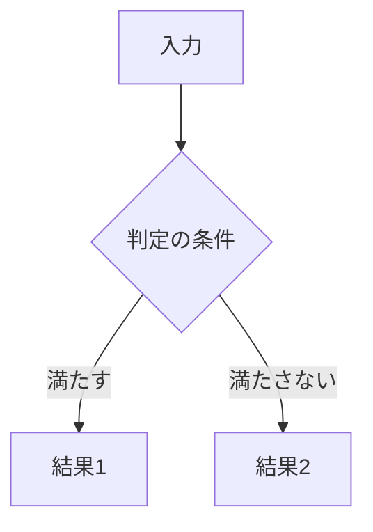
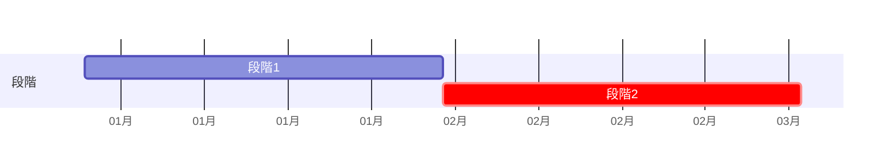

# [要確認] 文書の題名（主題の名詞。例: 請求書取り込みの運用・移行設計）

<!-- 原文: [要確認] 文書名（原文日付、行数、所在）。本書は改稿案で、原文は変更していない。
     主張の出所は ../claims.csv。本文に見せる主張IDは未決と提案だけ。方針・決定・事実・参考値・想定は、正本の章に claims のコメント（claims: C1,C2 の形）で書く。
     作業の経緯（何をまとめた・削った・仮に決めた）は本文に書かず、本人への報告に書く。 -->

| 項目 | 内容 |
|---|---|
| この文書で決めること | [要確認] |
| 読む人 | [要確認] 担当者と、§1 だけ読めばよい人 |
| 関連文書 | [要確認] 正本の所在（規則／本番構成／指標・合格条件）。無ければ行ごと消す |
| 原文 | [要確認] 文書名（原文日付、行数）。章の対応は付録 |
| 状態 | 改稿案（YYYY-MM-DD）。特記の無い記述は原文の方針。決定・想定・参考値・未決・提案はその場に書く |

## 1. 要点と判断事項

<!-- 4行は必ず置く。要点は1行と正本への参照だけで、数値・条件の全文は正本の章に1回だけ書く。§1 は読む字数の3割まで -->

| 項目 | 要点 | 正本 |
|---|---|---|
| 何を変えるか | [要確認] 1行（現行 → 変更後、対象） | §2 |
| 次へ進む条件 | [要確認] 合格条件・試行の期間と、その状態（決定／方針／想定）。原文に無ければ「原文に無い」 | §[要確認] |
| 進むのを止める未決 | [要確認] N点。原文の未決・矛盾から N点、レビューで足した N点 | §1.1 |
| 決めたこと | [要確認] 決めた人と日付が残る決定（無ければ「原文に決定は無い」） | §[要確認] |

### 1.1 まだ決めていない点

<!-- 載せるのは原文の未決・原文の矛盾（両方の値を書く）・中身の無い段落を未決にしたもの・本人が採った追加（項目に「（レビューで追加）」）だけ。
     作業中に気づいた穴は claims.csv に target none で入れて報告に書き、ここには「レビューで見つけた穴 N件（報告）」の1行だけを書く。
     [要確認] と未決の主張ID はこの表に1回だけ。本文では「未決（§1.1）」と参照する。
     決める担当が原文に無ければ「原文に無い」。決め方が分からなければ空欄にし、全行が同じ値になる列は消す -->

| 項目 | 決める担当 | 決め方 |
|---|---|---|
| [要確認]（C[要確認]） | [要確認] | [要確認] |

## 2. 現行と変更後の全体像

<!-- 両側に原文の値がある行が2行以上あるときだけ表にする。無ければ1文で書く -->

| | 現行 | 変更後 |
|---|---|---|
| [要確認] 観点1 | | |
| [要確認] 観点2 | | |

## 3. 日常の運用

<!-- 原文に無い担当・頻度（「常時」など）は足さない。担当が無ければ「担当は原文に無い」 -->

| 周期 | 機械 | 人の作業と担当 |
|---|---|---|
| 日次 | | |
| 週次 | | |
| 月次 | | |
| 異常時 | | |

## 4. 判断基準と例外・変更・非機能への対応

<!-- 原文の条件と分岐の数を変えない。未決や矛盾する値は、図にも両方の値か「閾値（未決）」を描く -->

### 4.1 判定の規則

### 4.2 合格条件と警報

### 4.3 異常の対応

### 4.4 情報の取り扱い（原文にあれば。個人情報・保存期間など）

## 5. 計画と体制

<!-- 2つの段階・記述の関係が原文に無ければ、表の並びで順序を決めず「関係は未決」と書く -->

| 段階 | 期間（想定） | 次へ進む条件 |
|---|---|---|

## 6. 提案（未採択）

<!-- 原文に無い案だけをここに置く（図・運用の表・§1 には入れない）。1つの矛盾につき案は1つまで。
     原文に無い新しい仕組みは提案しない。評価用のデータで閾値を選ぶ案のように、評価の公正さを崩す案は出さない。
     提案が無ければ章ごと消す -->

| 提案 | 内容 | 原文の箇所 |
|---|---|---|

## 付録A 原文の章との対応

<!-- 「原文 §3 → §4.1」の対応だけ。削った理由・まとめた経緯は書かない（本人への報告に書く）。
     原文に要件表があれば「付録B 原文の要件表との対応」を足す。用語は意味が2つ以上ある語だけ、使う章で説明する -->

| 原文の章 | 本書 |
|---|---|
| 原文 §[要確認] | §[要確認] |
