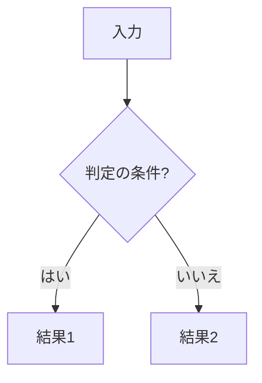
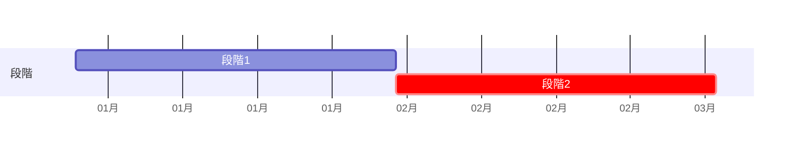

# [要確認] 文書の題名（主題の名詞。例: 請求書取り込みの運用・移行設計）

<!-- 原文: [要確認] 文書名（原文日付、行数、所在）。本書は組み替え案で、原文は変更していない。
     主張の出所は ../claims.csv。[要確認] はまだ決めていない値で、本書では補っていない。 -->

| 項目 | 内容 |
|---|---|
| この文書で決めること | [要確認] |
| 読む人 | [要確認] 担当者と、§1 だけ読めばよい人 |
| 関連文書 | [要確認] 正本の所在（規則／本番構成／指標・合格条件） |
| 原文 | [要確認] 文書名（原文日付、行数）。原文の章との対応は付録 |
| 状態 | 組み替え案（YYYY-MM-DD）。想定・参考値・提案・未決はその場に書き、方針・決定には付けない。根拠は claims.csv |

## 1. 要点と判断事項

<!-- 要点は1行と正本への参照だけ。数値・条件の全文は正本の章に1回だけ書く（同じ事実は2か所まで） -->

| 項目 | 要点 | 正本 |
|---|---|---|
| 解く問題 | [要確認] 1行 | §2 |
| 決めたこと | [要確認] 1行ずつ（原文に決定が無ければ「原文に決定は無い（方針は §2）」） | §[要確認] |
| まだ決めていない点 | [要確認] N点 | §1.1 |

### 1.1 まだ決めていない点

<!-- 載せるのは原文の未決・原文の矛盾・中身の無い段落を未決にしたもの・本人が採った追加だけ。作業中に気づいた穴は報告に書く（本人に尋ねられないときは3件まで「追加:」で載せてよい）。主張ID は未決の主張だけここに1回添える。決め方が分からなければ列ごと省く -->

| 項目 | 決める担当 | 決め方 |
|---|---|---|
| [要確認]（C[要確認]） | [要確認] | [要確認] |

## 2. 現行と変更後の全体像

| | 現行 | 変更後 |
|---|---|---|
| [要確認] 観点1 | | |

## 3. 日常の流れ

| 周期 | 機械（自動） | 人 | 担当 |
|---|---|---|---|
| 日次 | | | |
| 週次 | | | |
| 月次 | | | |
| 異常時 | | | |

## 4. 判断基準と例外・変更・非機能への対応

### 4.1 判定の規則

### 4.2 警報と合格条件

| 用途 | 指標 | データ | 頻度 | 対応 |
|---|---|---|---|---|

### 4.3 異常の対応

### 4.4 変更と復旧の単位

### 4.5 情報の取り扱い（原文にあれば。個人情報・保存期間など）

## 5. 計画

| 段階 | 期間（想定） | 次へ進む条件 | 戻す条件 | 判定者 |
|---|---|---|---|---|

## 6. 体制と作業量

| 担当 | 役割 | 定期の工数（想定） |
|---|---|---|

## 付録A 原文の章との対応

<!-- 「原文 §3 → §4.1」の対応だけ。削った理由は書かない（本人への報告に書く）。
     原文に要件表があれば「付録B 原文の要件表との対応」、意味が2つ以上ある語があれば「付録C 用語」を足す -->

| 原文の章 | 本書 |
|---|---|
| 原文 §[要確認] | §[要確認] |
