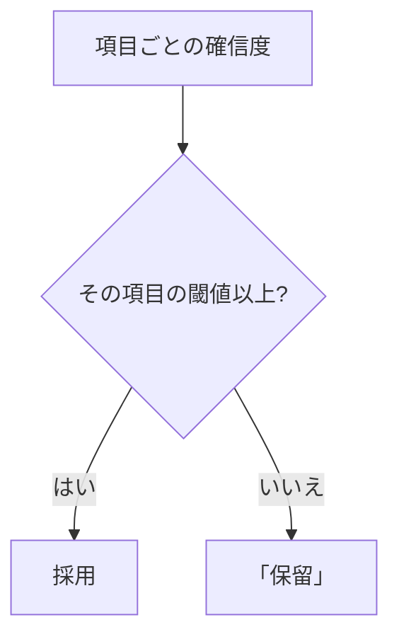
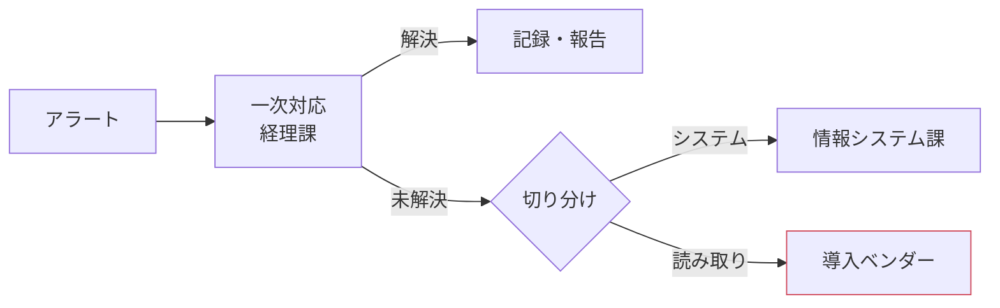

# 請求書取り込みの運用・移行設計（組み替え案・抜粋、架空の題材）

<!-- 架空の題材。会社・部署・数値・章番号はすべて作りもので、design-doc スキルの見本として置く。
     主張の出所は ../claims.csv（主張ID C1〜C19）。[要確認] はまだ決めていない値で、本書では補っていない。
     図は VSCode の Markdown プレビュー（Mermaid は拡張機能「Markdown Preview Mermaid Support」）と Notion でそのまま表示できる。 -->

| 項目 | 内容 |
|---|---|
| この文書で決めること | 日常の運用（誰がいつ何を確認するか）、判断基準（警報・合格・切り戻し）、移行の進め方と体制 |
| 読む人 | 経理課・情報システム課・導入ベンダーの担当者。移行の可否を判断する人は §1 だけ読めばよい |
| 関連文書 | 基本設計（読み取り規則・データ契約の正本）／処理設計（本番の設定と更新・復旧の正本）／精度検証（指標・合格条件の正本） |
| 原文 | 運用・移行設計（架空、原文日付 2026-09-15、9章）。原文の章との対応は付録C |
| 状態 | 組み替え案（2026-10-01）。決定・方針・想定・提案・未決の区別は各表の「状態」列と claims.csv |

## 1. 要点と判断事項

| 項目 | 内容 | 状態 |
|---|---|---|
| 解く問題 | 経理課が請求書を手で入力しており、月末の3日間に作業が集中し、打ち間違いは月次の照合まで見つからない | 方針（C1） |
| 対象 | 取引先から PDF で届く請求書だけ。紙の請求書の扱いは確認中（C10） | 方針（C1） |
| 提案の要点 | OCR で読み取り、自信がない項目だけ人が確かめる。読み誤りを記録して閾値を月次で見直す | 決定（C1） |
| 今回決めたこと | 変えること／「保留」の扱い／切替の条件／体制と進め方（§1.2） | 決定（C1〜C4） |
| まだ決めていない点 | 「保留」の上限の数値、手入力の誤り率、確認作業の月あたり時間、紙の請求書の扱い（§1.3） | 未決（C5〜C7、C10） |

### 1.1 目的と対象

月末の入力作業を減らし、読み誤りを記録して読み取りの設定を改善し続けられるようにする（原文 §1）。対象は PDF で届く請求書の取り込みだけで、会計システム自体の改修は対象外とする（原文 §1・§2）。

### 1.2 今回決めたこと

1. 経理課が手で入力する現行から、OCR で読み取って人が確かめる方式に変える（C1）
2. 自信がない項目は「保留」に回し、「保留」を含む請求書の割合に上限を置く（C2）
3. 項目別の読み誤りが手入力以下、かつ「保留」が上限以下、かつ見積書・納品書の混入が手入力以下なら切り替える。満たさなければ手入力を続ける（C3）
4. 経理課・情報システム課・導入ベンダーの3者で、4段階・3か月（想定）で移す（C4）

意思決定者への説明は、この4点を1枚ずつ伝えて齟齬を確かめる確認型スライド（`../index.qmd`）で行う。読み取り規則の統一（§4.1）、本番の設定の単位（§4.4）は担当者間で片付ける設計の整理で、本編の話題にはしない。

### 1.3 まだ決めていない点

| 項目 | 決める担当 | 決め方 |
|---|---|---|
| 「保留」を含む請求書の割合の上限 | 経理課長 | 閾値の候補ごとに読み誤りと「保留」の割合を実測し、確認に割ける時間で決める（C6） |
| 手入力の誤り率 | 情報システム課 | 評価用の請求書で再集計する（C5）。原文の約1%は再集計前の参考値（C17） |
| 確認作業の月あたり時間 | 経理課 | 並行運用の前に1か月分を実測する（C7）。原文の1日20分は想定 |
| 紙で届く請求書の扱い | 設計書の作成者 | スキャンして対象にするか、手入力を続けるか（C10） |
| 確信度が閾値と等しいときの扱い | 情報システム課 | 基本設計 §4.2 に書き足す（C14） |
| 閾値の見直しの使い分けと承認者 | 情報システム課 | 定期の見直しと、読み誤りが増えたときの見直しの使い分け、合格判定、承認者（C15） |

## 2. 現行と移行後の全体像

| | 現行 | 移行後 |
|---|---|---|
| 入力 | 経理課が PDF を見て会計システムに手で入力 | OCR で読み取り、会計システムへ自動で登録（C1） |
| 確認 | 月次の照合で打ち間違いを見つける | 自信がない項目（「保留」）だけ経理課が確かめる（C2） |
| 改善 | 打ち間違いの記録が残らない | 読み誤りを記録し、閾値を月次で見直す（C8） |
| 対象 | 全請求書 | PDF で届く請求書（紙は確認中、C10） |

対象についての記述は原文の中で分かれている（基本設計 §1「PDF のみ」、原文 §2「全請求書」）。どちらが実態かを作成者に確認するまで、本書は PDF だけの説明で進め、確定後にこの表を直す。

## 3. 日常の運用と改善の流れ

| 周期 | 機械（自動） | 人 |
|---|---|---|
| 日次 | 取り込み・読み取り・会計システムへの登録 | 「保留」の確認 20分 |
| 週次 | 読み誤りの集計 | 誤りの記録の見直し 30分 |
| 月次 | 閾値の評価 | レビュー 1時間・設定変更の承認 |
| 異常時 | アラート発報 | 一次対応 30分/回 |

原文の §3.1・§3.3・§5.2（周期・人の作業・時間）に分かれていた内容を1つの表にした。時間は原文の想定で、実績ではない（C11）。原文 §3.1 の「人の作業は不要」は、この表の人の作業と食い違うので削る。

### 3.1 定常処理

請求書の取り込み・読み取り・会計システムへの登録はバッチで自動実行する。経理課は日次で「保留」の項目を確かめ、週次で読み誤りの記録を見直す。情報システム課と経理課は月次に読み誤りと「保留」の割合を確認する。閾値を変えるときは、評価と承認を経て本番へ反映する（承認者は未決、C15）。

### 3.2 月次の評価と見直し

月次に照合済みの請求書で項目別の読み誤りと「保留」の割合を測り、§4.2 の合格条件を下回れば閾値を見直す。閾値だけを変えるときは本番の設定の番号を進める（§4.5）。定期の見直しと、読み誤りが増えたときの見直しの使い分けは未決（C15）。

## 4. 判断基準と例外・変更への対応

> 1つの項目が「保留」でも、ほかの項目は採用する。確信度が閾値と等しいときの扱いは未決（C14）。

読み取り規則は基本設計 §4.2 が正本で、本書と精度検証 §5.3 はそこを参照する。「項目ごとに閾値と比べる」と「請求書の全項目が閾値以上なら採用」の2規則が並んでいたものを、確認する項目が最も少ない前者に統一する（C2）。

### 4.1 読み取り規則と「保留」の意味

「保留」は確認画面では1つの一覧にし、ログには理由を分けて残す（文字が読めない／確信度が低い／請求書ではない書類の疑い）。これは案で、基本設計の用語表の修正と合わせて決める。確信度が低いことだけで「請求書ではない書類」とは判断しない。

### 4.2 警報と合格条件

| 用途 | 指標 | データ | 頻度 | 対応 | 状態 |
|---|---|---|---|---|---|
| 日次の警報 | 「保留」の割合、項目別の割合、確信度の分布の変化 | 当日の取り込みログ（正解不要） | 日次 | 経理課が一次対応（§4.3） | 提案（C16） |
| 月次の測定 | 項目別の読み誤り、「保留」の割合 | 照合済みの請求書 | 月次 | 合格条件を下回れば閾値を見直す（§3.2） | 提案（C16） |
| 切替・変更の合格 | ①項目別の読み誤りが手入力以下 ②「保留」が上限以下 ③見積書・納品書の混入が手入力以下 | 評価用の請求書。閾値は調整用の請求書で決めて評価前に固定（C8） | 切替時・設定変更時 | 3つすべて満たせば反映。1つでも欠ければ手入力を続ける | 決定（C3） |

原文 §4.2 の「読み取り精度99%未満の常時監視」は、正解が月次の照合でしか得られないため成り立たない。上の2段に置き換える案（C16）。約1%という参考値と99%を、測定時期・方式・対象を省いて比較しない（C17）。

### 4.3 異常の対応と切り分け

原文 §4.3 の手順と §7.1 の切り分けは同じ流れなので、1つの図にまとめて原文 §7.1 から参照する（C12）。

### 4.4 本番の設定の番号と切り戻し

| 番号 | OCR エンジン | 前処理 | 閾値 | 項目定義 |
| :-- | :-- | :-- | :-- | :-- |
| s7 | e-2026-08 | p2 | t-0901 | 12項目 |
| s8 | e-2026-08 | p2 | **t-0915** | 12項目 |

閾値だけの変更でも番号を進める。版管理の表に閾値と項目定義の列を足し、切り戻しの単位をこの番号にする（C13、案）。正本は処理設計 §2.1・§5.2 と基本設計 §6.1 で、原文の版管理には閾値と項目定義がなく、取り込みログの版は engine_version だけ。表の値は書き方の例で、実際の番号ではない。

### 4.5 閾値を変えるとき、読み取る項目を変えるとき

- 閾値を変えるとき: 調整用の請求書で決め、本番の設定の番号を進める（C18、案）
- 読み取る項目を追加・変更するとき: 項目定義とテンプレートを作り直し、§4.2 の合格条件で判定する（C18、案）

原文 §9 は題が閾値で本文が項目の追加だったため、2つに分けた。

## 5. 移行計画

| 段階 | 期間（想定） | 次へ進む条件 | 戻す条件 | 判定者 |
|---|---|---|---|---|
| 試験導入 | 1か月 | §4.2 の切替の3条件を評価用の請求書で満たす | — | [要確認] |
| 並行運用 | 1か月 | 本番の請求書でも3条件を満たし、確認作業の時間が見積り内 | 1つでも満たさなければ手入力を続ける | [要確認] |
| 本番切替 | 1週間 | 切替後の日次警報が出ない | 3条件を欠けば前の番号へ戻す（§4.4） | [要確認] |
| 定常運用 | 3週間 | §3 の月次の流れが1回まわる | 同上 | — |

期間は原文 §6.1–6.4 の想定で、確約ではない（C4）。表の「期間の列」は残し、図を表の上に置いた。開始日は未定なので図の日付は仮。原文 §6.2–6.3 の「大きな差がない」「明らかな悪化」は、§4.2 の合格条件への参照に置き換える案（C9）。判定者は未決（C15）。

## 6. 体制と作業量

| 担当 | 役割 | 定期の工数（想定） |
|---|---|---|
| 経理課 | 「保留」の確認、誤りの記録、一次対応 | 確認 月 [要確認] 時間（C7）。日次20分、異常時30分/回（C11） |
| 情報システム課 | 会計システムとの連携・切替、月次の評価 | 月次レビュー 1時間（C11） |
| 導入ベンダー | 読み取り設定・閾値の調整 | [要確認] |

並行運用中の増分（手入力と OCR の両方の確認）は未見積もり（C7）。

## 付録A 原文の要件表の参照ずれ

| 要件 | 内容 | 原文の参照先 | 参照先の実際の内容 |
|---|---|---|---|
| RQ-03 | 「保留」の確認画面 | 原文 §5.1 | 監視項目 |
| RQ-04 | 設定の版管理 | 原文 §6.1 | 移行期間 |
| RQ-05 | 月次レポート | 原文 §7.1 | 障害の切り分け |

原文との照合で確認（C19、原文 40–44行）。節番号の付け替えだけでは、未記載の仕様は補われない。要件ごとに「記載済み／未決／別文書」と確認方法を付ける。

## 付録B 用語

| 用語 | 本書での意味 | 状態 |
|---|---|---|
| 「保留」 | 人が確かめる項目。ログでは理由を分ける（読めない／確信度が低い／請求書ではない書類の疑い） | 案（§4.1） |
| 確信度 | OCR が項目ごとに出す、読み取り結果の確からしさ（0〜1） | 基本設計 §4.2 |
| 閾値 | 項目ごとに持つ確信度の下限。これ未満なら「保留」 | 基本設計 §4.2 |
| 本番の設定の番号 | OCR エンジン・前処理・閾値・項目定義の組に付ける番号 | 案（C13） |
| 評価用／調整用の請求書 | 合否を測る請求書／閾値を決める請求書。混ぜない | 方針（C8） |

## 付録C 原文の章との対応

| 原文の章 | 本書 |
|---|---|
| 原文 §1・§2（目的・対象） | §1.1、§2 |
| 原文 §3.1・§3.3・§5.2（周期・人の作業・時間） | §3 |
| 原文 §4.2（監視） | §4.2 |
| 原文 §4.3・§7.1（異常対応・切り分け） | §4.3 |
| 原文 §6（移行の4段階） | §5 |
| 原文 §9（閾値・項目の変更） | §4.5 |
| 原文 §2（要件表） | 付録A |
