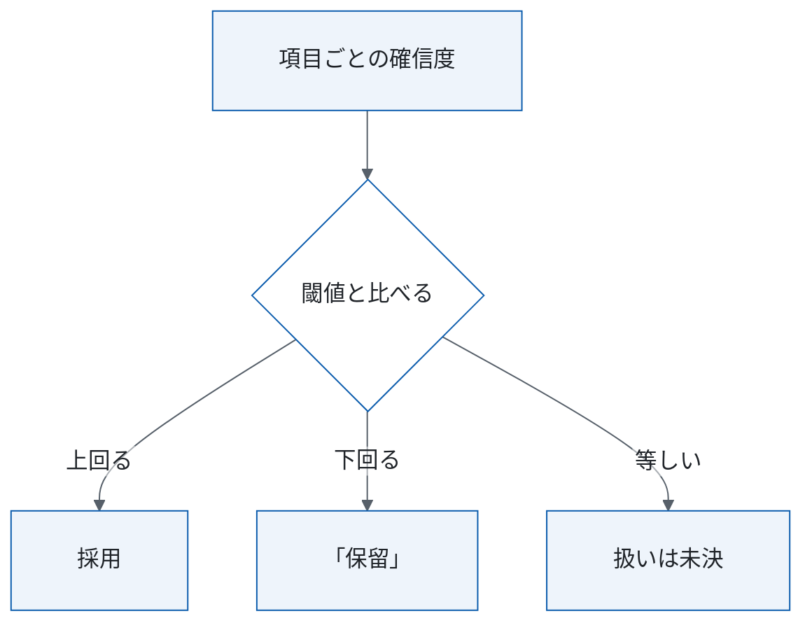
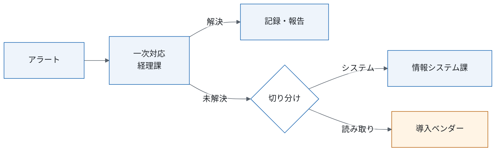
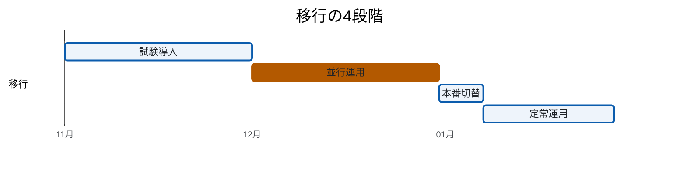

# 請求書取り込みの運用・移行設計（改稿案・抜粋、架空の題材）

<!-- 架空の題材。会社・部署・数値・章番号はすべて作りもので、design-doc スキルの見本として置く。
     主張の出所は ../claims.csv（主張ID C1〜C19）。主張IDは本文に見せず、段落か表の直後の claims のコメントに書く。
     図は VSCode の Markdown プレビュー（Mermaid は拡張機能「Markdown Preview Mermaid Support」）と Notion でそのまま表示できる。 -->

| 項目 | 内容 |
|---|---|
| この文書が扱うこと | 日常の運用（誰がいつ何を確認するか）、判断基準（合格・異常）、移行の進め方と体制 |
| 読む人 | 経理課（§3〜§4）・情報システム課（§4〜§5）・導入ベンダー（§4.3、§5）の担当者。移行の可否を判断する人は §1 だけ読めばよい |
| 関連文書 | 基本設計（読み取り規則・データ契約の正本）／処理設計（本番の設定と更新・復旧の正本）／精度検証（指標・合格条件の正本）／説明用スライド（`../index.qmd`） |
| 原文 | 運用・移行設計（架空、2026-09-15、9章）。章の対応は付録B |
| 状態 | 改稿案（2026-10-01）。特記の無い記述は原文の方針。決定・想定・参考値・未決・提案はその場に書く |

## 1. 要点と判断事項

| 項目 | 要点 | 正本 |
|---|---|---|
| 何を変えるか | 経理課の手入力を、OCR で読み取って自信のない項目（「保留」）だけ人が確かめる方式に変える。対象は PDF で届く請求書 | §2 |
| 次へ進む条件 | 並行運用のあと、項目別の読み誤りが手入力以下、「保留」を含む請求書の割合が上限以下、見積書・納品書の混入が手入力以下、の3つをすべて満たせば本番に切り替える。ほかの段階の条件は原文に数値が無い | §4.2、§5 |
| まだ決めていない点 | 6点（うちレビューで足した1点） | §1.1 |
| 決めたこと | 方式の変更、「保留」の割合の上限、切替の3条件、3者・4段階の移行の4点（経理部長、2026-09-20 の定例） | §2、§4、§5 |

### 1.1 まだ決めていない点

| 項目 | 決める担当 | 決め方 |
|---|---|---|
| 「保留」を含む請求書の割合の上限 | 経理課長 | 閾値の候補ごとに、調整用の請求書で読み誤りと「保留」の割合を測り、確認に割ける時間で決める |
| 手入力の誤り率 | 情報システム課 | 評価用の請求書で再集計する。原文の約1%は「目安であり再集計する」値 |
| 確認作業の月あたり時間（レビューで追加） | 経理課 | 並行運用の前に1か月分を実測する |
| 紙で届く請求書の扱い | 設計書の作成者 | スキャンして対象にするか、手入力を続けるか。原文 §2 は「全請求書」、基本設計 §1 は「PDF のみ」と書いている |
| 確信度が閾値と等しいときの扱い | 情報システム課 | 原文は「上回る」と「以上」が混在している。基本設計 §4.2 に書き足す |
| 閾値の見直しの使い分けと承認者 | 情報システム課 | 定期の見直しと、読み誤りが増えたときの見直しの使い分け、合格判定、承認者 |

<!-- claims: C6,C5,C7,C10,C14,C15,C17 -->

## 2. 現行と移行後の全体像

| | 現行 | 移行後 |
|---|---|---|
| 入力 | 経理課が PDF を見て会計システムに手で入力し、月末の3日間に作業が集中する | OCR で読み取り、会計システムへ自動で登録する |
| 確認 | 打ち間違いは月次の照合まで見つからず、記録も残らない | 自信がない項目（「保留」）だけ経理課が確かめ、読み誤りを記録する |

方式の変更は決定。対象は PDF で届く請求書で、紙で届く請求書の扱いは未決（§1.1）。

<!-- claims: C1 -->

## 3. 日常の運用

| 周期 | 機械（バッチ） | 人の作業と担当（時間は想定） |
|---|---|---|
| 日次 | 取り込み・読み取り・会計システムへの登録 | 経理課が「保留」を確かめる（20分） |
| 週次 | 読み誤りの集計 | 経理課が誤りの記録を見直す（30分） |
| 月次 | 閾値の評価 | 情報システム課と経理課がレビューする（1時間）。閾値の変更は承認を経て反映する（承認者は未決、§1.1） |
| 異常時 | アラート | 経理課が一次対応する（1回30分、§4.3） |

<!-- claims: C11 -->

## 4. 判断基準と例外・変更への対応

図1 項目ごとの採否の規則。1つの項目が「保留」でも、ほかの項目は採用する。等しいときの扱いは未決（§1.1）。

項目ごとに閾値と比べる規則にそろえ、「保留」を含む請求書の割合に上限を置く（決定）。精度検証 §5.3 の「請求書の全項目が閾値以上なら採用」は使わず、規則の正本は基本設計 §4.2 にする。

<!-- claims: C2 -->

### 4.1 「保留」の意味

「保留」は人が確かめる項目を指す。原文は理由を3つ挙げている（文字が読めない／確信度が低い／請求書ではない書類の疑い）。

### 4.2 合格条件と監視

切替と設定変更の合格条件は次の3つで、すべて満たせば反映し、1つでも欠ければ手入力を続ける（決定）。

1. 項目別の読み誤りが手入力以下
2. 「保留」を含む請求書の割合が上限以下（上限は未決、§1.1）
3. 見積書・納品書を請求書として取り込む割合が手入力以下

合否は評価用の請求書で測る。閾値は調整用の請求書で決め、評価の前に固定する。

<!-- claims: C3,C8 -->

原文 §4.2 は「読み取り精度99%未満」を常時監視するとしている。正解は月次の照合でしか得られないので、このままでは測れない。置き換えの提案は §6。

### 4.3 異常の対応と切り分け

図2 異常の対応と切り分け

<!-- claims: C12 -->

### 4.4 読み取る項目を追加するとき

項目定義とテンプレートを作り直し、§4.2 の3条件で判定する。原文 §9 は題が閾値の変更で、本文は項目の追加だけを書いている。閾値の変更の手順は提案（§6）。

## 5. 移行の進め方と体制

図3 移行の4段階（開始日は仮）

| 段階 | 期間（想定） | 次へ進む条件 |
|---|---|---|
| 試験導入 | 1か月 | 原文に無い |
| 並行運用 | 1か月 | §4.2 の3条件をすべて満たす（決定）。原文 §6.2 の「大きな差がない」を具体化した |
| 本番切替 | 1週間 | 「明らかな悪化」が無い（原文 §6.3。数値は無い） |
| 定常運用 | 3週間 | — |

経理課・情報システム課・導入ベンダーの3者で、図3 の段階の順に移す（決定）。開始日は未定なので、図の日付は仮に置いた。異常時の分担は §4.3 の図が正本。移行では、情報システム課が会計システムとの連携と切替を、導入ベンダーが読み取りの設定と閾値の調整を受け持つ。

<!-- claims: C4 -->

## 6. 提案（未採択）

<!-- 架空の題材では、採否を決める材料として、本人（経理部長）が提案を設計書に載せると決めた想定 -->

| 提案 | 内容 | 原文の箇所 |
|---|---|---|
| 警報を2段に分ける | 日次は正解の要らない指標（「保留」の割合、項目別の割合、確信度の分布の変化）で経理課が一次対応する。月次は照合済みの請求書で §4.2 の3条件を測り、下回れば閾値を見直す | 原文 §4.2 |
| 本番の設定に番号を付ける | OCR エンジン・前処理・閾値・項目定義の組に番号を付けて取り込みログに残し、切り戻しはこの番号の単位で行う。原文の版管理には閾値と項目定義が無い | 処理設計 §2.1・§5.2、基本設計 §6.1 |
| 閾値の変更の手順 | 閾値は調整用の請求書で決め、番号を進めるだけでよい | 原文 §9 |
| 段階ごとに戻す条件 | 各段階で §4.2 の3条件を満たさなければ手入力へ戻す | 原文 §6.2–6.3 |

<!-- claims: C16,C13,C18,C9 -->

## 付録A 原文の要件表の参照ずれ

| 要件 | 内容 | 原文の参照先 | 参照先の実際の内容 |
|---|---|---|---|
| RQ-03 | 「保留」の確認画面 | 原文 §5.1 | 監視項目 |
| RQ-04 | 設定の版管理 | 原文 §6.1 | 移行期間 |
| RQ-05 | 月次レポート | 原文 §7.1 | 障害の切り分け |

<!-- claims: C19 -->

## 付録B 原文の章との対応

| 原文の章 | 本書 |
|---|---|
| 原文 §1・§2（目的・対象） | §1、§2 |
| 原文 §3.1・§3.3・§5.2（周期・人の作業・時間） | §3 |
| 原文 §4.2（監視） | §4.2、§6 |
| 原文 §4.3・§7.1（異常対応・切り分け） | §4.3 |
| 原文 §6（移行の4段階） | §5、§6 |
| 原文 §9（閾値・項目の変更） | §4.4、§6 |
| 原文 §2（要件表） | 付録A |
