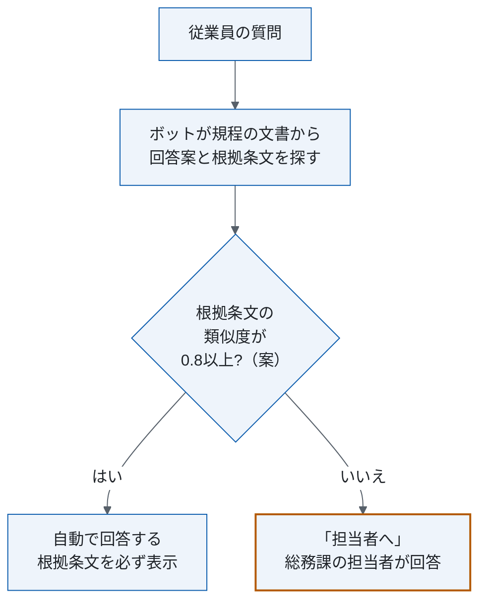
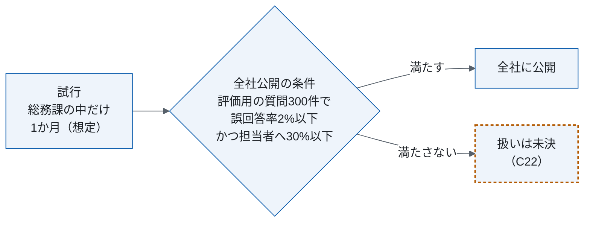

# 社内規程問い合わせボットの運用・移行設計（組み替え案、架空の題材）

<!-- 架空の題材。会社・部署・数値はすべて作りもの（原文の注記のとおり）。
     原文: design/_source/ops.md（2026-09-15、ドラフト、章は11・105行。リポジトリには入れない）。原文は変更していない。
     主張の出所は ../claims.csv（C1〜C26）。[要確認] はまだ決めていない値で、補っていない。
     C24〜C26 は試験のため作業者が仮に決めた提案で、本人はまだ採っていない。 -->

| 項目 | 内容 |
|---|---|
| この文書で決めること | 質問を自動で回答するか担当者へ回すかの判定、日常の運用（誰がいつ何をするか）、警報と全社公開の条件、試行から全社公開への進め方と体制 |
| 読む人 | 総務課・情報システム課・外部ベンダーの担当者。全社公開の可否を判断する人は §1 だけ読めばよい |
| 関連文書 | 原文が参照する「要件の詳細」（原文 §12）は原文に無く、所在は未決（§1.3、C16） |
| 原文 | 社内規程問い合わせボットの運用・移行設計書（架空、2026-09-15、ドラフト、章は11）。原文の章との対応は付録A |
| 状態 | 組み替え案（2026-10-02）。原文はドラフトで、決めた人と日付のある決定は無い。方針・想定・提案・未決の区別は各表の「状態」列と claims.csv |

## 1. 要点と判断事項

| 項目 | 内容 | 状態 |
|---|---|---|
| 現行 | 総務課の担当者2名が社内チャットで質問に手で回答している。問い合わせは月約600件（2026年7月の実績） | 事実（C2） |
| 対象 | 就業規則・経費規程・旅費規程についての従業員の質問。経理の個別の精算処理（特定の申請の承認状況など）は対象外 | 方針（C1） |
| 変更後 | ボットが規程の文書から回答案を作り、根拠の条文を必ず示す。示せない質問は総務課の担当者へ回す（「担当者へ」） | 方針（C3） |
| 全社公開の条件 | 評価用の質問300件で誤回答率2%以下、かつ「担当者へ」の割合30%以下 | 方針（C11） |
| 進め方 | 総務課の中だけで1か月試行し、その後全社に公開する | 想定（C13） |
| 原文の矛盾をそろえる案 | 3点（§1.1）。自動で回答する閾値が原文に2つある、など | 提案 |
| まだ決めていない点 | 9点（§1.3）。回答期限、障害と警報への対応、全社公開の判定など | 未決 |

### 1.1 原文の矛盾をそろえる案（未採択）

| 案 | 残る確認 | 状態 |
|---|---|---|
| 自動で回答する類似度の閾値を §4.1 の1か所に書き、試行は0.8で始める | 0.8で「担当者へ」の割合が30%以下に収まるか（試行で測る） | 提案（C24） |
| 「担当者へ」の割合の30%を全社公開の判定、40%を運用中の警報として1つの表に並べる（§4.2） | 運用中に30%を超え40%以下のときの扱い | 提案（C25） |
| 回答モデル・検索の設定・閾値・索引の組に番号を付け、戻す単位にする（§4.4） | 変更を承認する担当 | 提案（C26） |

3つとも、組み替えの作業者が試験のため仮に決めた案で、本人はまだ採っていない。根拠は各節に書いた。原文の記述は claims.csv に両方残している。

### 1.2 原文の繰り返しと参照の誤り

原文で2か所に書かれていた3つの内容は1か所にまとめた。ボットの方式は原文 §3・§5 から §4.1 へ、各課の役割は原文 §4.1・§8 から §3 へ、確認作業の時間は §6 へ。原文 §10 の「要件の詳細は §12 を参照」が指す原文 §12 は無く（原文は §11 まで）、所在を未決にした（C16）。

### 1.3 まだ決めていない点

| 項目 | 決める担当 | 決め方 | 主張 |
|---|---|---|---|
| 「担当者へ」回した質問の回答期限 | 総務課長 | 原文のとおり総務課長が決める | C15 |
| 障害時と、警報（週次40%超）を受けたときの対応 | 情報システム課（仮） | 誰が何を確かめ、どこへ回すか、ボットが止まっている間の質問の扱い | C17 |
| 誤回答率の測り方と、抜き取りで誤回答を見つけたときの扱い | 総務課長（仮） | 母数（300件全体か、自動で回答した質問だけか）、判定する人、現行の約3%と測り方をそろえるか | C19 |
| 全社公開の判定 | 総務課長（仮） | 評価の時期、判定する人、満たさないときの扱い、公開後に戻す条件、条件を見直す手続き | C22 |
| 索引を作り直す担当と、作り直すまでの回答の扱い | 総務課長（仮） | 改定日から最大3営業日、改定前の条文を根拠に回答する質問をどう扱うか | C20 |
| 根拠条文の類似度の定義 | 外部ベンダー（仮） | 何と何を比べるか、算出方法、値の範囲 | C21 |
| 情報の取り扱いの要件 | 情報システム課（仮） | 社員番号を伏せることとログの1年保存のほかに要るもの | C18 |
| 定期の工数 | 原文の作成者（仮） | 「担当者へ」の質問への回答時間と監視・調整の工数を見積もり、確認作業1日30分を実測する | C23 |
| 要件の詳細の所在 | 原文の作成者（仮） | 原文 §10 が指す原文 §12 に当たる資料を示す | C16 |

「（仮）」は、原文に決める担当が無く、組み替えの作業者が仮に置いた担当。

## 2. 現行と変更後の全体像

| | 現行 | 変更後 |
|---|---|---|
| 回答する人 | 総務課の担当者2名が社内チャットで手で回答（C2） | ボットが自動で回答し、根拠の条文を示せない質問だけ総務課の担当者が回答（C3） |
| 回答の根拠 | 原文に記述なし | 回答の根拠となる条文を必ず表示（C3） |
| 誤回答率 | 約3%（目安。2026年10月に再集計、C12） | 評価用の質問300件で2%以下が全社公開の条件（C11） |

現行の約3%は目安で、実績ではない（C12）。合格条件の2%と比べるには誤回答率の測り方をそろえる（§1.3、C19）。

## 3. 日常の流れ

| 周期 | 作業 | 担当 | 状態 |
|---|---|---|---|
| 質問のたび | 回答案を作り、根拠の条文を示して回答する。示せなければ「担当者へ」回す | ボット | 方針（C3） |
| 質問のたび | 「担当者へ」回された質問に回答する。回答期限は [要確認] | 総務課 | 方針（C8）、未決（C15） |
| 日次 | ボットの回答から20件を抜き取って確認する | 総務課 | 方針（C6） |
| 週次 | 「担当者へ」の割合が40%を超えたら通知を受ける。受けた後の対応は [要確認] | 情報システム課 | 方針（C9）、未決（C17） |
| 随時 | ボットの稼働状況を監視する | 情報システム課 | 方針（C8） |
| 随時 | 回答モデルと検索の設定を調整する | 外部ベンダー | 方針（C8） |
| 規程の改定時 | 規程を更新する。改定日から3営業日以内に検索の索引を作り直す（作り直す担当は [要確認]） | 総務課 | 方針（C8・C10）、未決（C20） |
| 障害時 | [要確認] | [要確認] | 未決（C17） |

各課の役割はこの表が正本で、原文 §4.1 の文と原文 §8 の表が同じ内容だったものを1つにした（C8）。

### 3.1 質問のログ

質問文に含まれる社員番号は、ログに保存する前に伏せる。ログの保存期間は1年（C14）。このほかの情報の取り扱いの要件は [要確認]（C18）。

## 4. 判断基準と例外・変更への対応

> 橙の枠は人が動く箇所。0.8は §4.1 の案。類似度の定義は [要確認]（C21）。

### 4.1 自動で回答するか、担当者へ回すか

根拠の条文を示せる質問だけ自動で回答し、示せない質問は総務課の担当者へ回す（C3）。示せるかどうかは、根拠条文の類似度を閾値と比べて決める。

原文は §3 で0.75以上（C4）、§5 で0.8以上（C5）と、閾値を2通りに書いている。規則の正本をこの節の1か所にし、試行は0.8で始める案（C24、未採択）。0.8の方が自動で回答する質問が少ないので、誤った自動回答を抑える側から始められる。代わりに「担当者へ」回る質問が増えるため、その割合が合格条件の30%以下に収まるかを試行で測る。

### 4.2 警報と全社公開の条件

| 用途 | 指標 | データ | 時期 | 値 | 超えた・満たさないとき | 状態 |
|---|---|---|---|---|---|---|
| 全社公開の判定 | 誤回答率と「担当者へ」の割合 | 評価用の質問300件 | [要確認]（C22） | 誤回答率2%以下かつ「担当者へ」30%以下 | 満たせば全社に公開。満たさないときは [要確認]（C22） | 方針（C11） |
| 運用中の警報 | 「担当者へ」の割合 | 運用中の質問 | 週次 | 40%を超える | 情報システム課に通知。受けた後の対応は [要確認]（C17） | 方針（C9） |

同じ「担当者へ」の割合に、原文 §6 の30%と原文 §4.2 の40%があり、どちらを超えたら何をするかが書かれていない。30%を全社公開の判定、40%を運用中の警報として用途で分けた（C25、案）。誤回答率の母数と、誤回答と判定する人は [要確認]（C19）。

### 4.3 規程を改定したとき

改定日から3営業日以内に検索の索引を作り直す（C10）。作り直す担当と、作り直すまでの間に改定前の条文を根拠に回答する質問の扱いは [要確認]（C20）。原文 §8 の表は総務課に「規程の更新」を置くが、索引を作る担当は書かれていない。

### 4.4 設定を変えるとき・戻すとき（案）

回答モデル、検索の設定、類似度の閾値、索引（どの版の規程から作ったか）の組に番号を付け、変えるたびに記録し、戻すときはこの番号の単位で戻す（C26、案）。原文には外部ベンダーの調整（原文 §4.1）と索引の作り直し（原文 §4.3）があるが、変えた後の記録と戻す単位が無い。閾値はすでに2つの値があり、変わりうる。変更を承認する担当は決めていない。

## 5. 計画

| 段階 | 期間（想定） | 次へ進む条件 | 戻す条件 | 判定者 |
|---|---|---|---|---|
| 試行（総務課の中だけ） | 1か月 | §4.2 の全社公開の条件を満たす | — | [要確認]（C22） |
| 全社公開 | — | — | [要確認]（C22） | [要確認]（C22） |

期間は原文の想定で、確約ではない（C13）。原文 §6 の「状況に応じて柔軟に見直す」は中身が無いので、条件を見直す手続きとして未決に入れた（C22）。

## 6. 体制と作業量

| 担当 | 定期の工数（想定） |
|---|---|
| 総務課 | 確認作業 1日30分（未実測、C7）。「担当者へ」の質問への回答時間は [要確認]（C23） |
| 情報システム課 | [要確認]（C23） |
| 外部ベンダー | [要確認]（C23） |

役割は §3 の表を参照。1日30分の「確認作業」が抜き取りだけか、「担当者へ」の質問への回答も含むかは原文に無い（C23）。

## 付録A 原文の章との対応

| 原文の章 | この文書 |
|---|---|
| 原文 §1 はじめに | 削った（前置きと一般論だけ） |
| 原文 §2 対象と範囲 | §1、§2 |
| 原文 §3 変更後の方式 | §2、§4.1 |
| 原文 §4.1 日常の運用 | §3、§6 |
| 原文 §4.2 監視 | §3、§4.2、§1.3 |
| 原文 §4.3 規程の更新 | §3、§4.3 |
| 原文 §5 判定の基準 | §4.1 |
| 原文 §6 合格条件 | §2、§4.2、§5 |
| 原文 §7 移行 | §5 |
| 原文 §8 体制 | §3、§6 |
| 原文 §9 情報の取り扱い | §3.1、§1.3 |
| 原文 §10 未決事項 | §1.3 |
| 原文 §11 おわりに | 削った（一般論だけ） |
