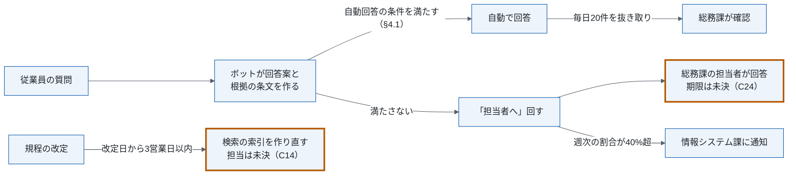
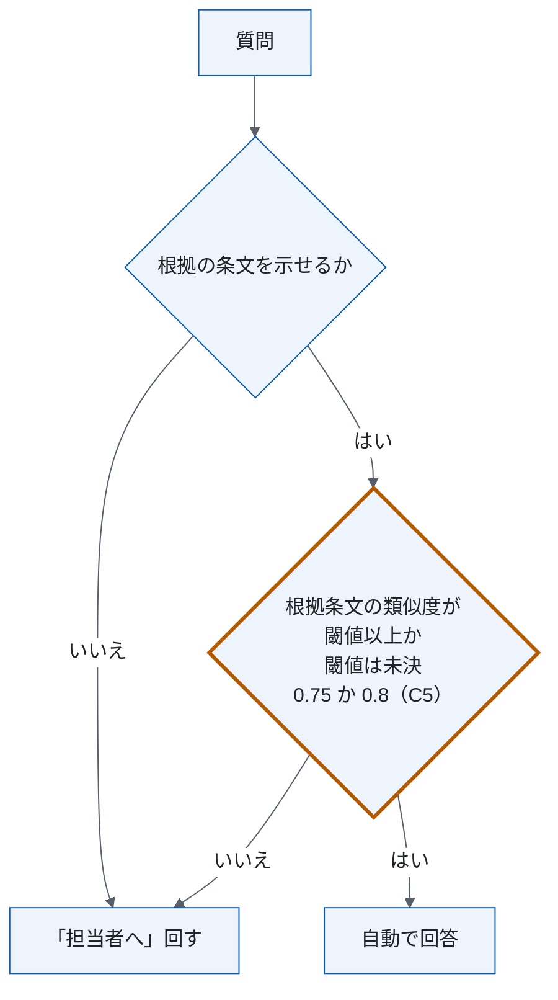
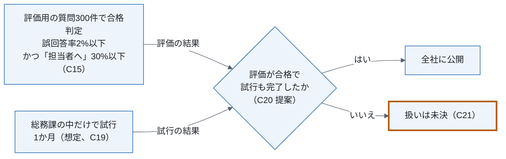

# 社内規程問い合わせボットの運用・移行設計（組み替え案、架空の題材）

<!-- 架空の題材。会社・部署・数値はすべて作りもの。原文は105行・11章・状態 ドラフト（2026-09-15）で、この文書は組み替え案。原文は変更していない。
     主張の出所は ../claims.csv（C1〜C28）。[要確認] はまだ決めていない値で、この文書では補っていない。 -->

| 項目 | 内容 |
|---|---|
| この文書で決めること | 規程の問い合わせにボットが自動回答する方式の、日常の運用（誰がいつ何を確認するか）、判断基準（自動回答・警報・全社公開の条件）、移行の進め方と体制 |
| 読む人 | 総務課・情報システム課・外部ベンダーの担当者。全社公開の可否を判断する人は §1 だけ読めばよい |
| 関連文書 | 原文に記載なし |
| 原文 | 社内規程問い合わせボットの運用・移行設計書（原文日付 2026-09-15、状態 ドラフト）。原文の章との対応は付録A |
| 状態 | 組み替え案（2026-10-02）。決定・方針・想定・提案・未決の区別は各表の「状態」列と claims.csv |

## 1. 要点と判断事項

| 項目 | 内容 | 状態 |
|---|---|---|
| 解く問題 | 総務課の担当者2名が、月約600件の規程の質問に手で回答している | 事実（C2） |
| 対象 | 人事・総務の社内規程の質問。経理の個別の精算処理は対象外 | 方針（C1） |
| 変えること | 手回答から、ボットが根拠の条文を示して自動で回答する方式に変える。示せない質問は総務課の担当者へ回す（以下「担当者へ」） | 方針（C3, C4） |
| 今回決めたこと | 決めた人と日付が残る決定は原文に無い。原文が方針とすることは §1.2 | — |
| まだ決めていない点 | 類似度の閾値が 0.75 と 0.8 の2通り、回答期限、障害時の対応など12点（§1.3） | 未決（C5 ほか） |
| 仮に決めたこと | 判定規則の正本を §4.1 に置く。全社公開は、評価の合格と試行の完了の両方を満たしたとき（§5） | 提案（C6, C20） |

### 1.1 現状と対象

現行は、総務課の担当者2名が社内チャットで従業員の質問に手で回答している。問い合わせは月約600件で、原文は2026年7月の実績としている（C2）。

対象は、人事・総務の社内規程（就業規則・経費規程・旅費規程）についての質問。経理の個別の精算処理（特定の申請の承認状況など）の質問は対象外とする（C1）。

### 1.2 原文が方針としていること

1. 手回答から、ボットが規程の文書から回答案を作り、根拠の条文を表示して自動で回答する方式に変える（C3, C4）
2. 総務課が「担当者へ」回された質問に回答し、ボットの回答のうち毎日20件を抜き取って確認する（C7）
3. 評価用の質問300件で、誤回答率が2%以下、かつ「担当者へ」回す割合が30%以下なら全社に公開する（C15）
4. 試行は総務課の中だけで1か月（想定）行い、その後全社に公開する（C19）

### 1.3 まだ決めていない点

| 項目 | 決める担当 | 決め方 |
|---|---|---|
| 自動回答の類似度の閾値: 0.75 か 0.8（C5） | 総務課長（仮） | 案: 評価用の質問300件で両方を測る（C6） |
| 全社公開の判定: 評価と試行の前後、試行で見る指標、満たさないときの扱い（C21） | 総務課長（仮） | — |
| 合格条件の測り方: 「誤回答」の定義と判定者、評価用の質問300件の作り方、「類似度」の算出方法（C18） | 総務課長（仮） | — |
| 「担当者へ」の割合の警報 40% と合格条件 30% の関係（C11） | 情報システム課（仮） | 案: 試行1か月の週次の割合を測る |
| 「担当者へ」回した質問の回答期限（C24） | 総務課長 | 総務課長が決める（原文） |
| 現行の誤回答率の再集計結果（C17） | 総務課長（仮） | 2026年10月に再集計する（原文） |
| 障害が発生したときの対応（C12） | 情報システム課（仮） | — |
| 検索の索引の作り直しを行う担当（C14） | 総務課長（仮） | — |
| 設定を変えるときの承認者と戻す手順（C28） | 情報システム課（仮） | — |
| 社員番号の伏せとログ保存1年 以外のセキュリティ対策（C23） | 情報システム課（仮） | — |
| 作業量と費用: 回答の工数、情報システム課・外部ベンダーの定期の工数、費用（C27） | 総務課長（仮） | 案: 試行1か月で実測する |
| 要件の詳細: 原文が §12 とした内容（C26） | 原文の作成者 | 作成者に確認する |

（仮）と「案」は、原文に無く、この組み替えで仮に置いた。「—」は決め方も原文に無い。

## 2. 現行と変更後の全体像

| 観点 | 現行 | 変更後 |
|---|---|---|
| 回答する人 | 総務課の担当者2名が社内チャットで手で回答（C2） | ボットが規程の文書から回答案を作り、根拠の条文を表示して自動で回答（C3, C4） |
| 総務課の作業 | 質問に手で回答（C2） | 「担当者へ」回された質問に回答し、毎日20件を抜き取って確認（C7） |
| 自動回答の条件 | — | 根拠の条文を示せて、類似度が閾値以上。閾値は [要確認]（C5, §4.1） |
| 誤回答率 | 約3%（参考値。再集計前、C16, C17） | 評価用の質問300件で2%以下（C15） |
| 公開 | — | 総務課の中で1か月試行（想定）し、全社に公開（C19, C20） |

## 3. 日常の流れ

橙の枠は、まだ決めていない点（§1.3）。

| 周期 | 内容 | 担当 | 状態 |
|---|---|---|---|
| 「担当者へ」回されたとき | 質問に回答する。回答期限は [要確認]（C24） | 総務課 | 方針（C7）、期限は未決 |
| 毎日 | ボットの回答から20件を抜き取って確認する。確認作業は1日30分 | 総務課 | 方針（C7）、時間は想定・未実測（C8） |
| 週次 | 「担当者へ」の割合が40%を超えたら通知する | 通知先は情報システム課 | 方針（C10） |
| 常時 | 稼働を監視し、通知に対応する | 情報システム課 | 方針（C9） |
| 随時 | 回答モデルと検索の設定を調整する（変更の扱いは §4.3） | 外部ベンダー | 方針（C9） |
| 規程の改定時 | 改定日から3営業日以内に検索の索引を作り直す。担当は [要確認]（C14） | [要確認] | 方針（C13） |

## 4. 判断基準と例外・変更への対応

### 4.1 自動回答か「担当者へ」かの判定

ボットは、根拠の条文を示せる質問のうち、根拠条文の類似度が閾値以上のものだけを自動で回答し、それ以外は「担当者へ」回す（C4, C5）。

閾値は、原文 §3 が 0.75 以上、原文 §5 が 0.8 以上と書き、値が違う。どちらが正かは [要確認] とし、この節を判定規則の正本にする（C5, C6）。何と何の類似度か、算出方法も原文に無い（C18）。

### 4.2 警報と合格条件

| 用途 | 指標 | データ | 頻度 | 対応 | 状態 |
|---|---|---|---|---|---|
| 全社公開の合格 | 誤回答率 2%以下、かつ「担当者へ」の割合 30%以下 | 評価用の質問300件 | 公開の判断のとき | 満たせば全社に公開。満たさないときの扱いは [要確認]（C21） | 方針（C15） |
| 警報 | 「担当者へ」の割合 40%超 | 運用中の質問（母数は原文に無い） | 週次 | 情報システム課に通知 | 方針（C10） |
| 参考（現行） | 誤回答率 約3%（目安） | 現行（人手）の回答 | 2026年10月に再集計 | 再集計の結果は [要確認]（C17） | 参考値（C16） |

「担当者へ」の割合には、合格条件の30%以下（評価用）と警報の40%超（運用中）の2つの数値がある。関係と40%の根拠は原文に無い [要確認]（C11）。「誤回答」の定義と判定者、評価用の質問300件の作り方も [要確認]（C18）。

### 4.3 障害時の対応と設定の変更

障害が発生したときの対応（誰が・何を・いつまでに）は [要確認]。原文は「迅速かつ適切に対応する」とだけ書いている（C12）。

回答モデルと検索の設定は、外部ベンダーが調整する（C9）。類似度の閾値を含む設定を変えるときの承認者と、戻す手順は [要確認]（C28）。

### 4.4 情報の取り扱い

質問文に含まれる社員番号は、ログに保存する前に伏せる。ログの保存期間は1年とする（C22）。

これ以外のセキュリティ対策は [要確認]。原文は「セキュリティには万全を期す必要がある」とだけ書き、中身が無い（C23）。

## 5. 計画

全社公開の条件は、合格条件（C15）の達成と、総務課の中での試行1か月（C19）の完了の両方とする（C20、提案）。原文 §6 は、合格すれば全社に公開するとし、原文 §7 は、試行1か月の後に全社に公開するとしていて、2つの関係を書いていない。

| 段階 | 期間 | 進む条件 | 満たさないとき |
|---|---|---|---|
| 評価 | [要確認] | 誤回答率 2%以下、かつ「担当者へ」の割合 30%以下（評価用の質問300件、C15） | [要確認]（C21） |
| 試行（総務課の中だけ） | 1か月（想定、確約ではない、C19） | [要確認]（C21） | [要確認]（C21） |
| 全社公開 | — | 評価の合格と試行の完了の両方（C20、提案） | — |

## 6. 体制と作業量

| 担当 | 役割 | 定期の工数 |
|---|---|---|
| 総務課 | 「担当者へ」回された質問への回答、ボットの回答の抜き取り確認、規程の更新（C7, C14） | 確認作業は1日30分（想定。未実測、C8）。回答の工数は [要確認]（C27） |
| 情報システム課 | 稼働の監視、通知への対応（C9） | [要確認]（C27） |
| 外部ベンダー | 回答モデルと検索の調整（C9） | [要確認]。費用も [要確認]（C27） |

## 付録A 原文の章との対応

| 原文の章 | この文書 | 扱い |
|---|---|---|
| 原文 §1 はじめに | なし | 4段落をすべて削除。前置きと一般論で、決定・条件・担当・数値が無い |
| 原文 §2 対象と範囲 | §1.1, §2 | 対象（C1）と現行（C2）を残す。導入を「望ましい」とする1段落は、方針の1文（C3）にした |
| 原文 §3 変更後の方式 | §2, §4.1 | 方式（C4）と閾値（C5）を残す。一般論2段落を削除 |
| 原文 §4 運用 | §3, §4.2, §4.3 | 担当・割合・期限（C7, C9, C10, C13）を残す。心構え2段落を削除。「迅速かつ適切に」の段落は障害時の対応を未決にした（C12） |
| 原文 §5 判定の基準 | §4.1 | 閾値（C5）を §4.1 にまとめ、原文 §3 と同じ文の1段落（C4）を削除 |
| 原文 §6 合格条件 | §4.2, §5 | 合格条件（C15）と現行の約3%（C16, C17）を残し、「柔軟に見直す」を削除 |
| 原文 §7 移行 | §5 | 試行1か月（C19）を残し、心構えを削除 |
| 原文 §8 体制 | §3, §6 | 役割表（C7, C9, C14）を残し、原文 §4.1 と同じ文の確認作業 1日30分（C8）を §6 の1か所にまとめた |
| 原文 §9 情報の取り扱い | §4.4 | 社員番号とログ（C22）を残し、「万全を期す」は未決にした（C23） |
| 原文 §10 未決事項 | §1.3, §3 | 回答期限（C24）を残す。原文の参照先 §12 は原文に無く（C25）、要件の詳細は未決（C26） |
| 原文 §11 おわりに | なし | 2段落とも削除。期待と意思表明で、決定・条件・担当・数値が無い |
