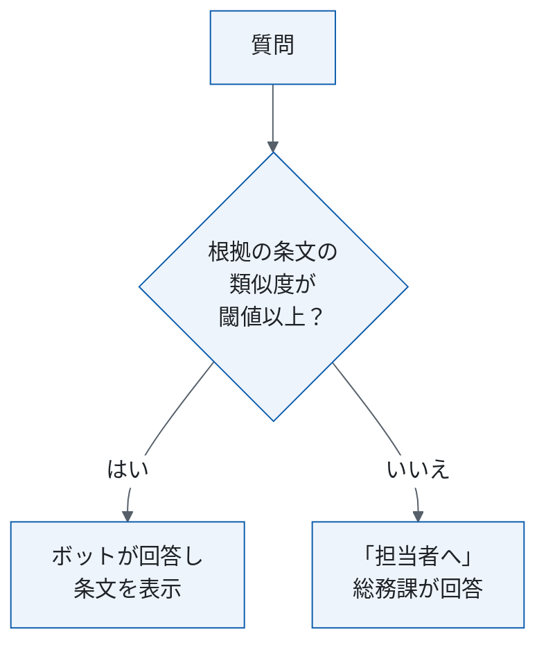

# 社内規程問い合わせボットの運用・移行設計（組み替え案）

<!-- 架空の題材。原文: 社内規程問い合わせボットの運用・移行設計書（ドラフト、2026-09-15、105行・11章）。原文は _source/ops.md に置き、変更していない。
     主張の出所は ../claims.csv。[要確認] はまだ決めていない値で、本書では補っていない。 -->

| 項目 | 内容 |
|---|---|
| この文書で決めること | 回答の判定、日常の運用と担当、全社公開の条件 |
| 読む人 | 総務課・情報システム課・外部ベンダー。公開を決める人は §1 と §5 だけ |
| 関連文書 | 原文に無い（要件の詳細は §1.1） |
| 原文 | 運用・移行設計書（ドラフト、2026-09-15）。対応は付録A |
| 状態 | 組み替え案（2026-10-02）。（仮）は作業者が仮に置いた |

## 1. 要点と判断事項

| 項目 | 要点 | 正本 |
|---|---|---|
| 解く問題 | 規程の質問への手での回答をボットに替える | §2 |
| 決めたこと | 原文に決定は無い（方針は §2） | — |
| まだ決めていない点 | 6点 | §1.1 |

### 1.1 まだ決めていない点

| 項目 | 決める担当 | 決め方 |
|---|---|---|
| 自動で答える閾値（§4） | 原文の作成者 | 本人に確認 |
| 「担当者へ」の回答期限（C20） | 総務課長 | 本人に確認 |
| 障害時の対応（C13） | 情報システム課（仮） | 本人に確認 |
| 社員番号の伏せ字・ログの保存期間のほかの安全対策（C19） | 情報システム課（仮） | 本人に確認 |
| 要件の詳細の所在（原文 §10 が指す §12 は無い。C21） | 原文の作成者 | 本人に確認 |
| （仮）全社公開の判定者と不合格時の扱い（C22） | 総務課長（仮） | 本人に確認 |

## 2. 現行と変更後: 誰が質問に答えるか

| | 現行 | 変更後 |
|---|---|---|
| 答える人 | 総務課の担当者2名が社内チャットで手で回答 | ボットが規程の文書から回答案を作り、根拠の条文を必ず表示する。示せない質問は総務課の担当者へ（「担当者へ」。C3・C4） |
| 件数 | 月約600件（2026年7月、参考値。C2） | |

対象は人事・総務の社内規程（就業規則・経費規程・旅費規程）についての従業員の質問。経理の個別の精算処理（特定の申請の承認状況など）は対象外（C1）。

## 3. 日常の運用: 誰がいつ何をするか

| いつ | 作業 | 担当 |
|---|---|---|
| 都度 | 「担当者へ」の質問に回答する（期限は §1.1。C6） | 総務課 |
| 毎日 | ボットの回答から20件を抜き取って確認する（C7）。確認は1日30分（想定・未実測。C8） | 総務課 |
| 常時 | 稼働を監視し、通知（§4.1）に対応する（C9） | 情報システム課 |
| 随時 | 回答モデルと検索の設定を調整する（C10） | 外部ベンダー |
| 規程の改定時 | 規程を更新する（C11）。改定日から3営業日以内に検索の索引を作り直す（C14） | 総務課（索引の作り直しを含むかは不明） |

## 4. 自動で答えるか、担当者へ回すか

閾値は未決（C5）。原文 §3 は0.75（未満は担当者へ）、原文 §5 は0.8（以上の場合に限り自動で回答）。

### 4.1 通知

「担当者へ」の割合が週次で40%を超えたら、情報システム課に通知する（C12）。

### 4.2 情報の取り扱い

質問文に含まれる社員番号は、ログに保存する前に伏せる。ログの保存期間は1年（C18）。

## 5. 全社公開までの計画

| 段階 | 期間（想定） | 全社公開の条件 | 判定者 |
|---|---|---|---|
| 総務課の中だけで試行 | 1か月（C17） | 評価用の質問300件で、誤回答率が2%以下、かつ「担当者へ」の割合が30%以下（C15） | [要確認]（§1.1） |

現行（人手）の誤回答率は約3%（目安。2026年10月に再集計する。参考値、C16）。

## 付録A 原文の章との対応

| 原文 | 本書 |
|---|---|
| 原文 §2 | §1・§2 |
| 原文 §3・§5 | §2・§4 |
| 原文 §4.1・§4.3・§8 | §3 |
| 原文 §4.2 | §4.1 |
| 原文 §6・§7 | §5 |
| 原文 §9 | §4.2 |
| 原文 §10 | §1.1 |
