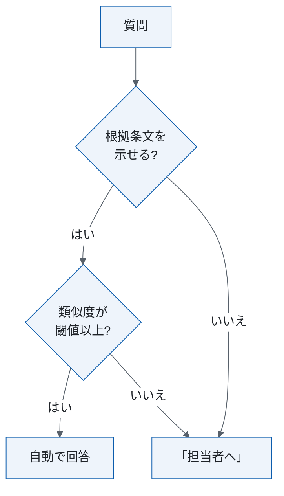
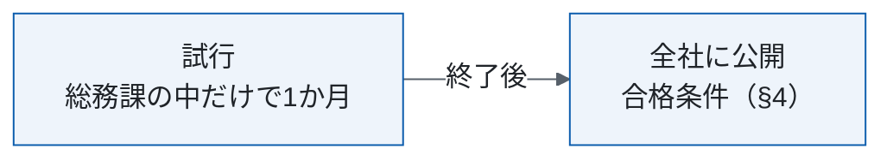

# 社内規程問い合わせボットの運用・移行設計

<!-- 原文: 社内規程問い合わせボットの運用・移行設計書（原文日付 2026-09-15、ドラフト、105行、design/_source/ops.md）。本書は組み替え案で、原文は変更していない。
     主張の出所は ../claims.csv（主張ID C1〜C33。C27・C29〜C33 は本文に載せない報告用）。[要確認] はまだ決めていない値で、本書では補っていない。 -->

| 項目 | 内容 |
|---|---|
| この文書で決めること | 自動回答の条件、確認の担当、全社公開の条件 |
| 読む人 | 総務課・情報システム課・外部ベンダー |
| 関連文書 | 原文に記載なし |
| 原文 | 運用・移行設計書（2026-09-15）。対応は付録A |
| 状態 | 組み替え案（2026-10-02）。特記の無い事項は方針。（仮）は本人未確認 |

## 1. 要点と判断事項

| 項目 | 要点 | 正本 |
|---|---|---|
| 変えること | 手回答をボット回答に替える | §2 |
| 決めたこと | 原文に決定は無い（方針は §2〜§5） | — |
| まだ決めていない点 | 7点 | §1.1 |

### 1.1 まだ決めていない点

| 項目 | 決める担当 | 決め方 |
|---|---|---|
| 類似度の閾値が2通り(C7) | 原文の作成者 | 合格条件の2指標を満たす値(提案。C8) |
| 回答期限(C25) | 総務課長 | 総務課長が決める |
| 要件の詳細(原文 §12 は無い。C26) | 原文の作成者 | 本人に確認 |
| 障害時の対応(C24) | 情報システム課長（仮） | 本人に確認 |
| セキュリティ対策(C23) | 情報システム課長（仮） | 本人に確認 |
| （仮）索引の作り直しの担当(C17) | 総務課長（仮） | 本人に確認 |
| （仮）合格条件の評価時点と不合格時の扱い(C28) | 原文の作成者 | 本人に確認 |

## 2. 現行と変更後の全体像

| 観点 | 現行（参考値） | 変更後 |
|---|---|---|
| 回答 | 総務課の担当者2名が社内チャットで手で回答(C1) | 自動回答を導入する(C5)。規程の文書から回答案を作り、根拠条文を必ず表示する。示せない質問は総務課の担当者へ回す（以下「担当者へ」。C6） |
| 質問 | 月約600件（2026年7月。C2） | 対象は人事・総務の社内規程（就業規則・経費規程・旅費規程）の質問(C3)。経理の個別の精算処理（特定の申請の承認状況など）は対象外(C4) |

## 3. 日常の流れと体制

| 担当 | 役割 |
|---|---|
| 総務課 | 「担当者へ」の質問に回答する(C9)。ボットの回答のうち毎日20件を抜き取って確認する(C10)。確認作業は1日30分（想定。未実測。C11）。規程の更新(C14) |
| 情報システム課 | 稼働状況の監視と通知への対応(C12)。障害時の対応は [要確認] |
| 外部ベンダー | 回答モデルと検索の設定の調整(C13) |

## 4. 判断基準と例外

| 項目 | 内容 |
|---|---|
| 自動回答 | 類似度の閾値は 0.75（原文 §3）か 0.8（原文 §5）[要確認] |
| 警報 | 「担当者へ」の割合が週次で40%を超えたら情報システム課に通知(C15) |
| 合格条件 | 評価用の質問300件で、誤回答率2%以下かつ「担当者へ」の割合30%以下なら全社に公開(C18) |
| 参考 | 現行（人手）の誤回答率は約3%（参考値。2026年10月に再集計。C19） |
| 規程の更新 | 改定日から3営業日以内に検索の索引を作り直す(C16)。担当は [要確認] |
| 情報の取り扱い | 質問文に含まれる社員番号は、ログに保存する前に伏せる(C21)。ログの保存期間は1年(C22)。これ以外の対策は [要確認] |

## 5. 移行

期間は想定であり、確約ではない(C20)。評価時点は [要確認]。

## 付録A 原文の章との対応

| 原文の章 | 本書 |
|---|---|
| 原文 §2・§3 | §2 |
| 原文 §4.1・§8 | §3 |
| 原文 §3・§4.2・§4.3・§5・§6・§9 | §4 |
| 原文 §7 | §5 |
| 原文 §10 | §1.1 |
| 原文 §1・§11 | 対応なし |
