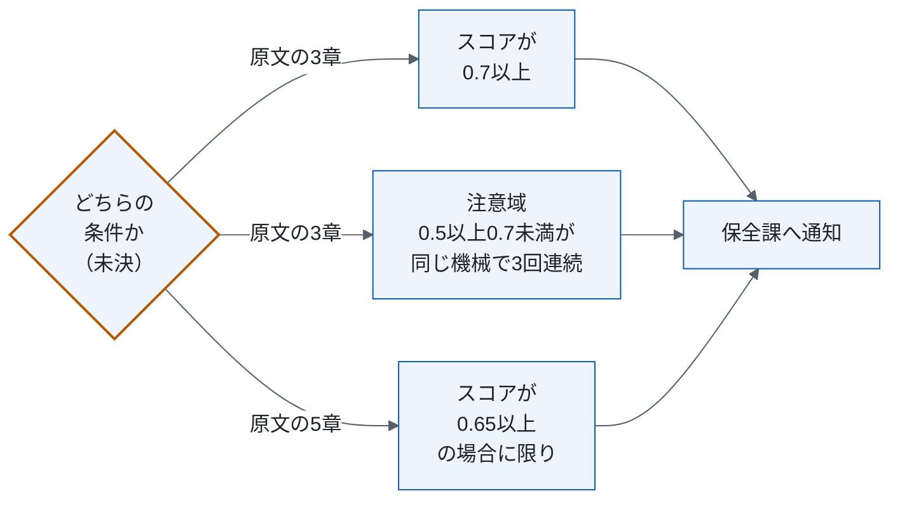
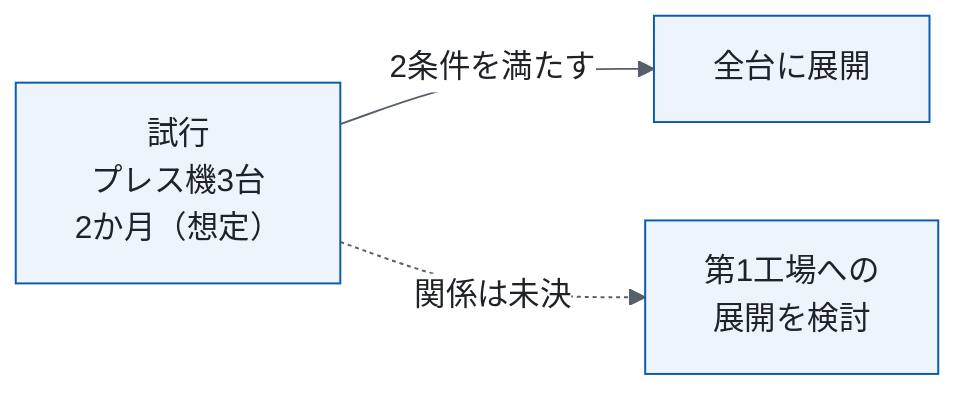

# 設備異常音検知の運用・移行設計

<!-- 架空の題材。原文: 設備異常音検知の運用・移行設計書（2026-09-25、ドラフト、11章・97行）。本書は改稿案で、原文は変更していない。
     主張の出所は ../claims.csv。本文に見せる主張IDは未決だけで、ほかは各章の claims のコメントに書く。 -->

| 項目 | 内容 |
|---|---|
| この文書で決めること | 通知の条件と担当、展開の条件、録音の保存 |
| 読む人 | 保全課・製造課・生産技術課。展開を判断する人は §1 だけ |
| 原文 | 設備異常音検知の運用・移行設計書（2026-09-25、ドラフト） |
| 状態 | 改稿案（2026-10-02）。特記の無い記述は原文の方針 |

<!-- claims: C32 -->

## 1. 要点と判断事項

| 項目 | 要点 | 正本 |
|---|---|---|
| 何を変えるか | プレス機12台にマイクを付け、異常スコアで保全課へ通知する | §2 |
| 次へ進む条件 | 試行で2条件を満たせば第2工場の全台に展開 | §5 |
| 進むのを止める未決 | 6点（すべて原文から） | §1.1 |
| 決めたこと | 原文に決定は無い | — |

### 1.1 まだ決めていない点

| 項目 | 決める担当 |
|---|---|
| 通知の条件（§4） | 原文に無い |
| 試行の後の展開先（§5） | 原文に無い |
| 夜間（22時〜6時）の通知の宛先 | 保全課長 |
| 再学習の周期、しきい値を調整する条件と担当 | 原文に無い |
| 情報セキュリティの管理 | 原文に無い |
| 原文 §10 が指す §13（無い） | 原文に無い |

<!-- claims: C6,C15,C19,C11,C18,C20 -->

レビューで見つけた穴 8件（報告）。

## 2. 現行と変更後の全体像

| | 現行 | 変更後 |
|---|---|---|
| 検知 | 保全課の担当者が全台を巡回し、耳で確かめる | マイクの音から異常スコア（0〜1）を計算 |
| 頻度 | 週1回 | 稼働中に1分ごと |
| 人の作業 | 巡回1台あたり約15分（目安） | 現地確認1回あたり20分（想定、未実測） |

対象は、第2工場のプレス機12台である。第1工場の設備と、組立ラインの搬送機は対象外とする。異常の見逃しは月3件（2026年8月の実績）。

<!-- claims: C1,C2,C3,C4,C5,C8 -->

## 3. 通知を受けたら誰が何をするか

| 担当 | 役割 |
|---|---|
| 保全課 | 通知を受けたら、必ず30分以内に現地で音を確かめ、結果を記録する。試行の評価 |
| 製造課 | 通知があった機械の稼働を止めるかどうかを決める |
| 生産技術課 | 誤通知率の報告を受けた対応、マイクの設置 |

<!-- claims: C7,C9,C16 -->

## 4. 通知の条件と、モデルの更新・録音の扱い

### 4.1 誤通知率の監視とモデルの更新

通知のうち、現地で異常が無かったものの割合（誤通知率）が月次で50%を超えた場合は、生産技術課に報告する。

モデルは定期的に再学習する。誤った通知が続いた場合は、適宜しきい値を調整する。周期・条件・担当は未決（§1.1）。

<!-- claims: C10,C12 -->

### 4.2 録音の保存

録音には作業者の会話が入ることがあるため、音声は30日で消去し、異常スコアだけを1年保存する。情報セキュリティは未決（§1.1）。

<!-- claims: C17 -->

## 5. 試行から展開へ進む条件

試行期間に、異常の見逃しが0件、かつ誤通知率が30%以下であれば、第2工場の全台に展開する。

第1工場は原文 §2 では対象外（未決、§1.1）。

<!-- claims: C13,C14 -->

## 付録A 原文の章との対応

| 原文の章 | 本書 |
|---|---|
| §2・§3 | §2 |
| §4.1・§8 | §3 |
| §3・§4.2・§4.3・§5・§9 | §4 |
| §6・§7 | §5 |
| §10 | §1.1 |
