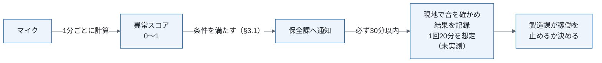
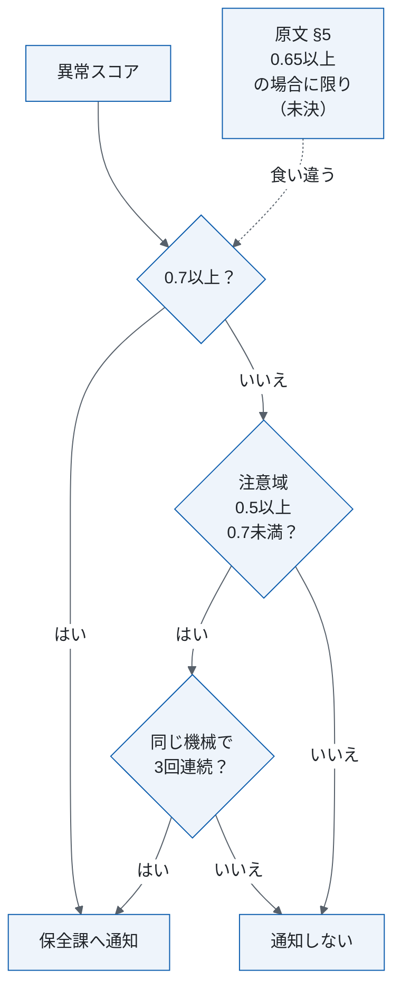
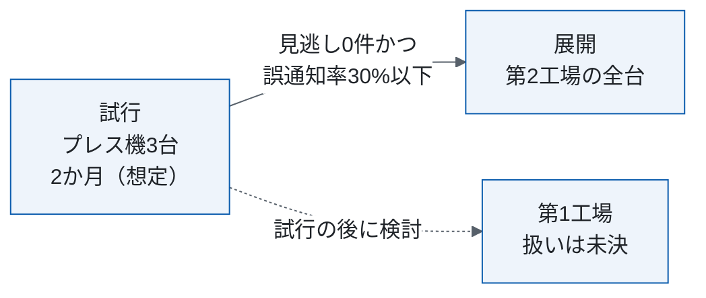

# 設備異常音検知の運用・移行設計

<!-- 原文: 設備異常音検知の運用・移行設計書（2026-09-25、ドラフト、97行）。本書は改稿案で、原文は変更していない。架空の題材。
     主張の出所は ../claims.csv。本文に見せる主張IDは未決と提案だけで、ほかは各章の claims のコメントに書く。 -->

| 項目 | 内容 |
|---|---|
| この文書で決めること | 通知の条件、稼働停止の判断、試行の合格条件と展開 |
| 読む人 | 保全課・製造課・生産技術課。展開の可否を判断する人は §1 だけ |
| 原文 | 運用・移行設計書（2026-09-25、ドラフト） |
| 状態 | 改稿案（2026-10-02）。特記の無い記述は原文の方針 |

## 1. 要点と判断事項

| 項目 | 要点 |
|---|---|
| 何を変えるか | 第2工場のプレス機12台に、マイクの異常スコアによる通知を入れる（§2） |
| 次へ進む条件 | 試行（2か月は想定）で見逃し0件かつ誤通知率30%以下なら全台へ展開する（方針、§4） |
| 進むのを止める未決 | 5点（原文の未決・矛盾から5点、レビューで足した0点、§1.1） |
| 決めたこと | 原文に決定は無い |

### 1.1 まだ決めていない点

| 項目 | 決める担当 |
|---|---|
| 通知のしきい値（§3.1、C7） | 原文に無い |
| 第1工場の扱い。対象外か、試行の後に展開を検討か（C18） | 原文に無い |
| 夜間（22時〜6時）の通知の宛先（C22） | 保全課長 |
| 情報セキュリティの管理の中身（C21） | 原文に無い |
| 詳細な仕様の所在（原文の §13 が無い、C23） | 原文に無い |

レビューで見つけた穴 9件（報告）。

## 2. 現行と変更後、通知を受けたときの運用

対象は第2工場のプレス機12台。第1工場の設備と組立ラインの搬送機は対象外とする（§1.1）。現行は、保全課の担当者が週1回、全台を巡回して耳で確かめる（1台あたり約15分（目安））。異常の見逃しは月3件（2026年8月の実績）。

誤通知率（通知のうち現地で異常が無かったものの割合）が月次で50%を超えた場合は、生産技術課に報告する。

モデルは定期的に再学習する。誤った通知が続いた場合は、しきい値を調整する。

<!-- claims: C1,C2,C3,C4,C5,C8,C9,C10,C11,C12,C13 -->

## 3. 判断基準と例外・変更

### 3.1 通知の条件

原文 §5 は「0.65以上の場合に限り」通知するとあり、図（原文 §3）と食い違う（未決、§1.1）。

<!-- claims: C6 -->

### 3.2 情報の取り扱い

録音には作業者の会話が入ることがあるため、音声は30日で消去し、異常スコアだけを1年保存する。情報セキュリティの管理の中身は未決（§1.1）。

<!-- claims: C20 -->

## 4. 合格条件と移行の計画

保全課が試行を評価し、生産技術課がマイクを設置する。合格条件は運用状況を見て見直す。

<!-- claims: C14,C15,C16,C17,C19 -->

## 付録 原文の章との対応

| 原文の章 | 本書 |
|---|---|
| §2・§4・§8 | §2、§4 |
| §3・§5 | §3.1 |
| §6・§7 | §4 |
| §9 | §3.2 |
| §10 | §1.1 |
