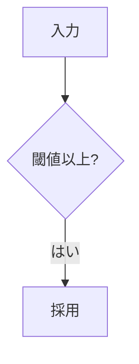
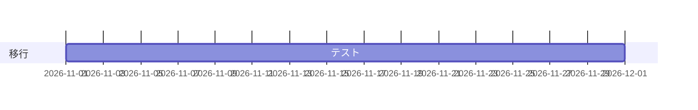

# 検査が通る設計書の例

| 項目 | 内容 |
|---|---|
| この文書で決めること | 例 |

## 1. 要点

| 項目 | 内容 |
|---|---|
| 要点 | §2 の規則と 3章 の計画 |

### 1.1 目的

基本設計 §9.9 は他の文書への参照なので検査しない。原文 §12・§13 も同じ。[要確認] は未決の印。

## 2. 規則

本文は 1.1節 を参照する。

## 3. 計画

## 付録A 用語

| 用語 | 意味 |
|---|---|
| 閾値 | 下限 |
