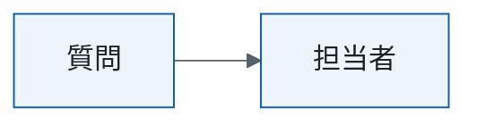

# 冗長な設計書の例

| 項目 | 内容 |
|---|---|
| この文書で決めること | 例 |

## 1. 要点

| 項目 | 内容 |
|---|---|
| 要点 | 例 |

本システムの運用にあたっては、関係者が密に連携し、円滑なコミュニケーションを図ることが重要である。

問い合わせは月600件あり、総務課の担当者2名が手で回答している。月末は回答が遅れる。

- 障害が発生した場合は、迅速かつ適切に対応する。
- 規程の改定から3営業日以内に索引を作り直す。

規程の改定から3営業日以内に索引を作り直すが、必要に応じて柔軟に見直し、継続的に改善していく。

## 2. 現行

問い合わせは月600件あり、総務課の担当者2名が手で回答している。

回答の根拠には就業規則・経費規程・旅費規程の該当する条文を必ず表示し、根拠の条文の類似度が0.75以上の質問だけを自動で回答し、類似度が0.75未満の質問や根拠の条文を表示できない質問は総務課の担当者へ回し、担当者は1営業日以内に回答する。担当者へ回した質問は週次で集計し、同じ質問が3回以上あれば規程の該当箇所に注記を足し、注記を足した規程は翌月の定例で総務課長が確かめ、確かめた結果を規程の改定履歴に記録する。
