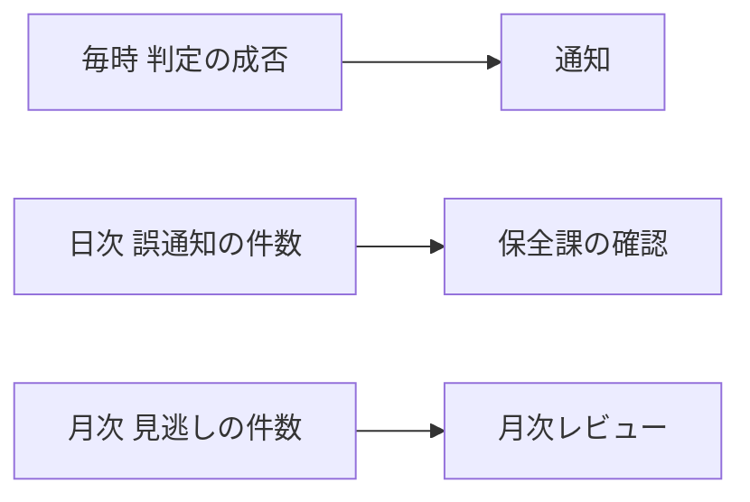

# 設備の異常音検知 運用設計（架空の題材）

| 項目 | 内容 |
|---|---|
| 扱うこと | 異常音検知の運用 |
| 読む人 | 保全課 |

## 1. 要点

マイクで集めた音を毎時判定し、異常の疑いを保全課へ通知する。切替は精度検証の条件を満たしてから行う。

## 2. 定常運用

| 周期 | 見るもの | 扱い |
|---|---|---|
| 毎時 | 判定の成否 | 失敗したら通知 |
| 日次 | 誤通知の件数 | 保全課の確認 |
| 月次 | 見逃しの件数 | 月次レビュー |

**判定は毎時に行う。** 収録の間隔は10分で、1時間分を1回で判定する（付録B）。

**誤通知は日次で数える。** 閾値は未確定である（付録B）。

**見逃しは月次で数える。** 標本の作り方は精度検証が決める（付録B）。

## 3. 障害対応

**判定が止まったら保全課へ知らせる。** 知らせる時間の上限は未確定である（付録B）。

**再実行は翌朝に行う。** 担当は未確定である（付録B）。

**マイクの故障は現地で確かめる。** 交換の手順は設備課の手順書による。

**録音の欠けは集計から除く。** 除いた期間は月次レビューで示す。

**収録装置の再起動は保全課が行う。** 再起動の回数の上限は付録Bにある。

## 付録B 未確定の値

| 項目 | 状態 |
|---|---|
| 誤通知の閾値 | 未確定 |
| 知らせる時間の上限 | 未確定 |
| 再実行の担当 | 未確定 |
